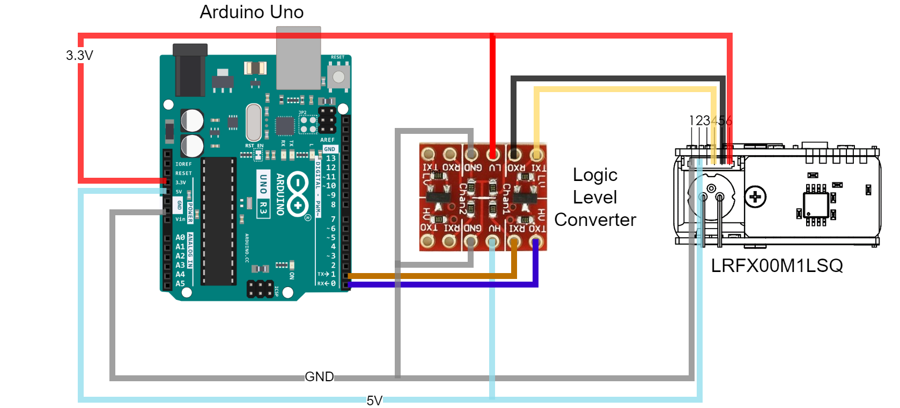

# **Implementation Manual: LRFX00M1LSQ Sensor on Arduino Uno Platform**

## **1. Hardware Setup**

### **1.1 Components Required**

* 1 × LRFX00M1LSQ Sensor
* 1 × Arduino Uno Microcontroller Board
* 1 × Logic Level Converter Module

### **1.2 Wiring Diagram**

---

## **2. Software Setup**

### **2.1 Uploading the Code**

Upload the provided example code to the Arduino Uno using the Arduino IDE.

### **2.2 Viewing Sensor Output**

After uploading the code, open the **Serial Monitor** from the Arduino IDE to observe the real-time measurement data from the sensor.

---

Would you like help formatting this as a downloadable PDF or adding version control and document metadata?
